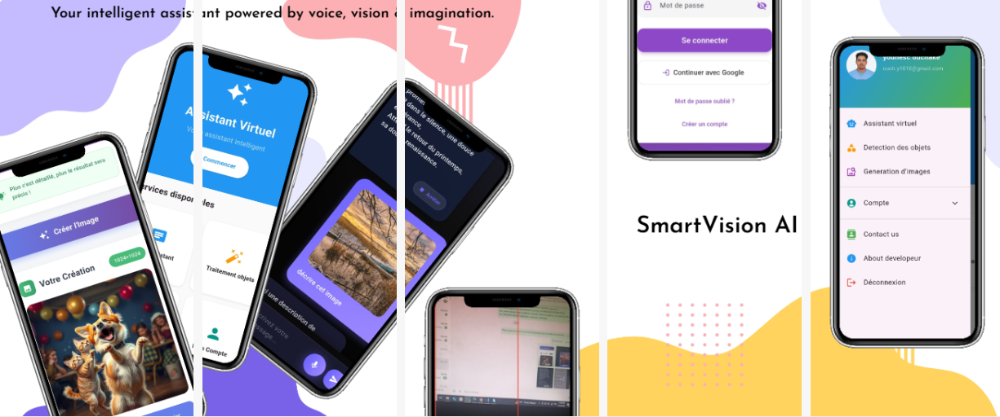

# SmartVision Assistant

## 📱 About

**SmartVision Assistant** is an innovative Flutter mobile application that combines artificial intelligence and computer vision to create an intelligent and versatile virtual assistant. The application offers an intuitive user experience with voice recognition, creative image generation, and real-time object detection.

## ✨ Key Features

###  Intelligent Virtual Assistant
- Integration with Google's Gemini API for intelligent conversations
- Voice recognition (Speech-to-Text) for natural interaction
- Text-to-Speech synthesis for audio responses
- Support for image input prompts for visual analysis

###  Image Generation
- Custom image creation via Pollinations.ai API
- Intuitive interface for entering creative descriptions
- Save and share generated images

###  Real-Time Object Detection
- Object recognition via camera with TensorFlow Lite
- Mobile-optimized performance
- Real-time display of detected objects

## 🔑 API Configuration

### Gemini API (Google)
1. Go to Google AI Studio
2. Create a new API key
3. Add the key to your .env file

### Pollinations.ai API
The Pollinations.ai API is free and doesn't require authentication keys.

## 📚 Documentation

- [Flutter Documentation](https://docs.flutter.dev/)
- [Gemini API](https://ai.google.dev/docs)
- [TensorFlow Lite](https://www.tensorflow.org/lite)
- [Pollinations.ai](https://pollinations.ai/)

## 🙏 Acknowledgments

- Google for the Gemini API
- The Pollinations.ai team for their image generation API
- The Flutter community for open source packages
- TensorFlow for TensorFlow Lite
- Dr. Anibou for her valuable collaboration and insightful guidance throughout the project.